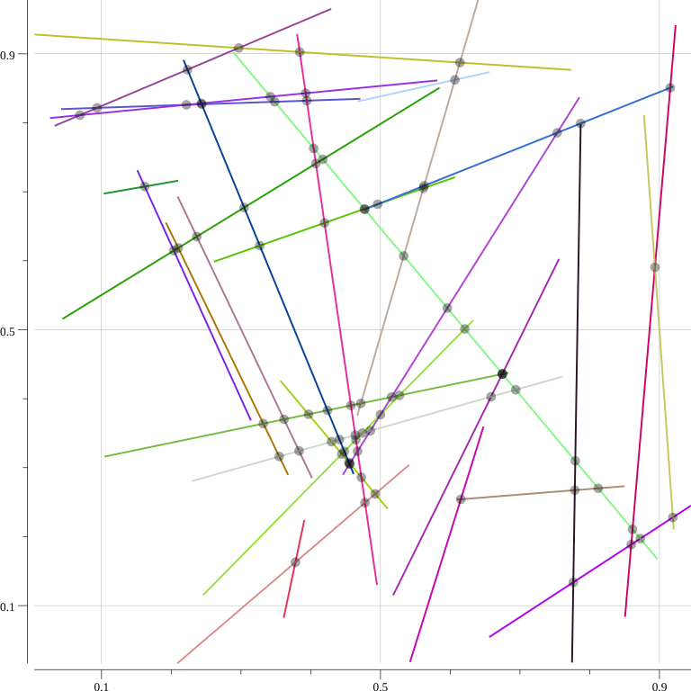

# grafs (Go)



Needed things
---
 * [Nix](https://nixos.org/nix/)

Quick start
---
```
$ nix-shell
[nix-shell:path/to/grafs/go]$ ./codegen
[nix-shell:path/to/grafs/go]$ go test geom bst
[nix-shell:path/to/grafs/go]$ go test geom -bench .
[nix-shell:path/to/grafs/go]$ go build -o bin/main main.go && ./bin/main -c -d -b -i -n 30 -s 0
[nix-shell:path/to/grafs/go]$ open out/
```
