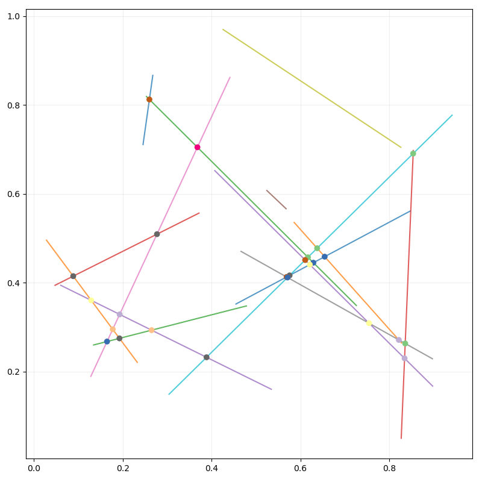

# grafs (Python)



Needed things
---
 * [Nix](https://nixos.org/nix/)

Quick start
---
```
$ nix-shell
[nix-shell:path/to/grafs/python]$ python src/main.py -c -p -s
[nix-shell:path/to/grafs/python]$ open out/
```
